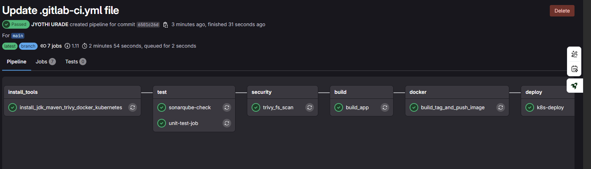
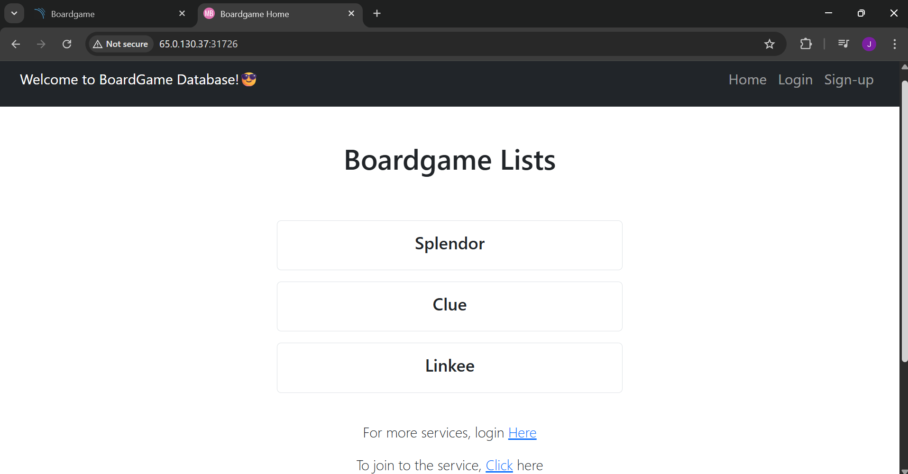
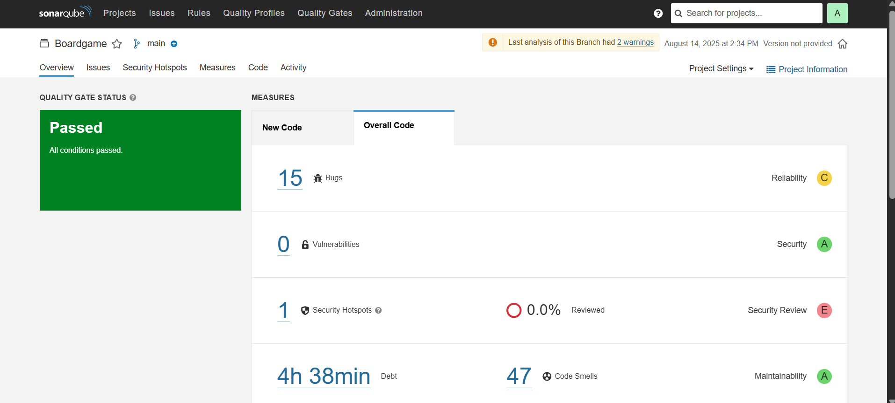

Hi, I'm **Jyothi Urade**👋

🌱 I’m an aspiring **DevOps & Cloud Engineer** learning in public. I build small, real projects and document everything I learn.

🔭 Current focus: CI/CD, containerization, Kubernetes, and DevSecOps

🧰 Toolbox: Linux • Git & GitHub • GitLab CI/CD • Jenkins • Docker • Kubernetes • SonarQube • Trivy • NGINX • Maven • Bash

✍️ I write detailed guides on Hashnode →  [FromCloudToOps](https://fromcloudtoops.hashnode.dev/)

---

🚀 **Flagship Project**

### Full‑Stack GitLab CI/CD with Kubernetes & Security

End‑to‑end pipeline for a sample Boardgame app with build, test, code quality, security scans, image build/push, and deploy to Kubernetes.

📖 Blog walkthrough (screenshots + steps): [https://fromcloudtoops.hashnode.dev/setting-up-a-full-stack-gitlab-cicd-pipeline-for-a-boardgame-project](https://fromcloudtoops.hashnode.dev/setting-up-a-full-stack-gitlab-cicd-pipeline-for-a-boardgame-project)

💻 Source code repo: \[ADD YOUR REPO LINK HERE]

🧪 Stages: build → test → SonarQube → Trivy → docker build/push → deploy (kubectl)

🔐 Security: SonarQube (quality & SAST), Trivy (image scan), secrets via GitLab CI variables

📸 Screenshots:

* **Pipeline stages:**
  

* **Deployment success:**
  

* **SonarQube report:**
  

---

📝 **Selected Blog Posts**

**DevSecOps & CI/CD**

* [SonarQube Setup with SSL & HTTPS](https://fromcloudtoops.hashnode.dev/sonarqube-setup-with-ssl-and-https)
* [Integrating HashiCorp Vault with Jenkins](https://fromcloudtoops.hashnode.dev/integrating-hashicorp-vault-with-jenkins-for-secure-secret-management)
* [Jenkins LDAP Integration with RBAC](https://fromcloudtoops.hashnode.dev/jenkins-ldap-integration-with-rbac-step-by-step-guide)
* [GitHub Webhook Trigger with Jenkins (Docker + Ngrok)](https://fromcloudtoops.hashnode.dev/setting-up-github-webhook-trigger-with-jenkins-locally-using-docker-ngrok)

**Cloud & Mini Projects**

* [AWS Free Tier DevOps mini project (Jenkins + Docker agent + email)](https://fromcloudtoops.hashnode.dev/aws-free-tier-devops-mini-project-jenkins-docker-agent-email-notifications)
* [Host static site with NGINX (reverse proxy & basics)](https://fromcloudtoops.hashnode.dev/how-to-set-up-nginx-as-a-reverse-proxy-for-a-nodejs-app)

**Scripting & Monitoring**

* [Website Monitoring & Log Archiving with Bash](https://fromcloudtoops.hashnode.dev/project-1-website-monitoring-and-log-archiving-with-bash)

**Application Setups**

* [3‑Tier Node.js + MySQL (local)](https://fromcloudtoops.hashnode.dev/building-a-3-tier-nodejs-mysql-project-locally)
* [3‑Tier Python + PostgreSQL (local)](https://fromcloudtoops.hashnode.dev/building-a-3-tier-python-postgresql-project-locally)

➡️ [See all posts](https://fromcloudtoops.hashnode.dev/)

---

🧠 **What I’m Learning Next**
Terraform (IaC) • Helm charts • Prometheus + Grafana • Docker

---

📫 **Connect**

* Blog: [https://fromcloudtoops.hashnode.dev/](https://fromcloudtoops.hashnode.dev/)
* Email: [jyothiurade874@gmail.com](mailto:jyothiurade874@gmail.com)
* LinkedIn: [https://www.linkedin.com/in/jyothi-urade/](https://www.linkedin.com/in/jyothi-urade/)
